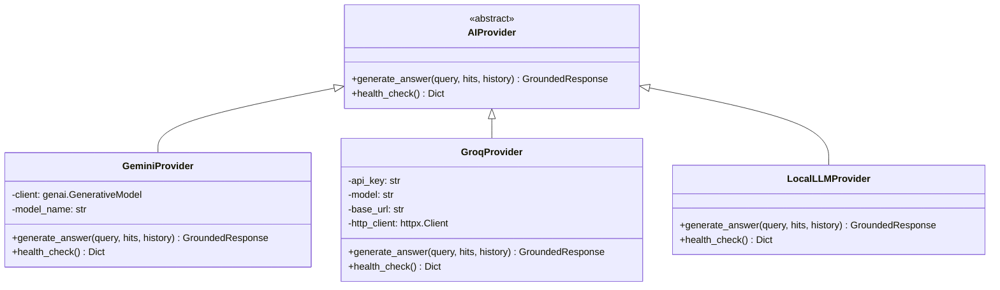

# AI Provider Architecture & Generation Pipeline

## 1. Architectural Philosophy
LexLite adheres to a decoupled, modular AI architecture. The RAG pipeline comprises three distinct, independent stages:
1. **Document Processing & Chunking**: Semantic hierarchy and token-aware segmenting.
2. **Dense Vector & Hybrid Retrieval**: FAISS vector index + BM25 keyword matching + Reciprocal Rank Fusion (RRF). This stage is 100% local (`all-MiniLM-L6-v2`) and costs $0.
3. **Response Synthesis & Grounding**: Pluggable AI generation provider.

---

## 2. Class Hierarchy & Interface Contract



---

## 3. Factory Implementation (`get_ai_provider`)

```python
# backend/app/services/ai_provider.py
def get_ai_provider(provider_type: Optional[str] = None) -> AIProvider:
    choice = (provider_type or settings.AI_PROVIDER or "gemini").lower()
    
    if choice == "groq":
        return GroqProvider()
    elif choice == "gemini":
        return GeminiProvider()
    elif choice in ("local", "offline", "mock"):
        return LocalLLMProvider()
    else:
        logger.warning(f"Unknown AI provider '{choice}'. Defaulting to Groq if key exists, else Local.")
        if settings.GROQ_API_KEY:
            return GroqProvider()
        return LocalLLMProvider()
```

---

## 4. Resilience & Fallback Hierarchy
When an AI request is initiated:
1. Retrieval is performed locally (FAISS/BM25) -> returns ranked `RetrievalHit` list.
2. If hits are empty or query is out-of-scope -> immediate deterministic refusal without calling external LLM.
3. Primary Provider (Groq or Gemini) is called with a 15-second timeout.
4. If Primary Provider returns 429 (Rate Limit Exceeded) or 503 (Provider Unavailable):
   - Error is logged.
   - Request degrades to `LocalLLMProvider`.
   - Structured citations from `RetrievalHit` are preserved and returned to the user with a low confidence/fallback flag.
   - User receives a factual response instead of a crash.
