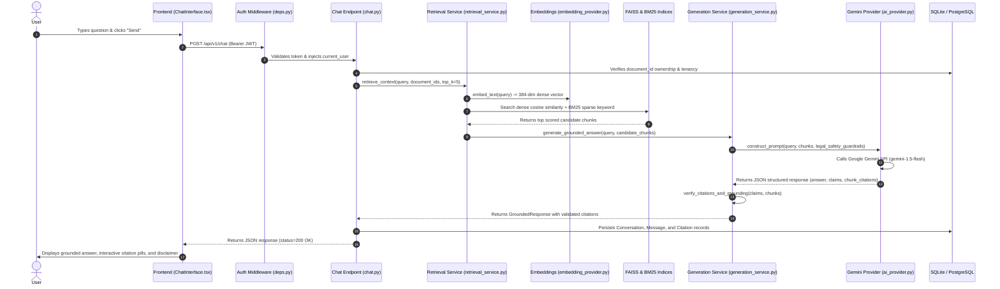

# End-to-End AI Request Lifecycle & RAG Sequence

This document traces the complete execution flow of a user legal question through the backend RAG pipeline, AI generation, citation validation, and frontend rendering.



---

## Detailed Step-by-Step Breakdown with Repository References

### Step 1: User Submits a Question
- **Component:** `frontend/src/components/chat/ChatInterface.tsx`
- **Function:** `handleSendMessage(e: FormEvent)`
- **Behavior:** The user enters a question regarding an uploaded document (e.g. *"What is the notice period for contract termination?"*). The input is sanitized and added to local UI state with an optimistic loading state.

### Step 2: Backend Authenticates the User
- **Component:** `backend/app/api/deps.py`
- **Function:** `get_current_user(token: str = Depends(oauth2_scheme), db: Session = Depends(get_db))`
- **Behavior:** The incoming HTTP `Authorization: Bearer <token>` header is decoded using `python-jose` and HMAC-SHA256 (`SECRET_KEY`). If expired, forged, or missing, an HTTP `401 Unauthorized` is returned immediately.

### Step 3: Selected Documents Are Verified
- **Component:** `backend/app/api/v1/chat.py`
- **Function:** `direct_chat(payload: DirectChatRequest, ...)`
- **Behavior:** The requested `document_id` is queried from the database. The query explicitly filters by `Document.id == payload.document_id` AND `Document.user_id == current_user.id`. If another user attempts to query a document they do not own, an HTTP `404 Not Found` or `403 Forbidden` is returned.

### Step 4: Query is Cleaned and Processed
- **Component:** `backend/app/services/retrieval_service.py`
- **Function:** `RetrievalService.retrieve_relevant_chunks(query: str, document_id: str, top_k: int = 5)`
- **Behavior:** Whitespace is stripped, special characters normalized, and legal acronyms preserved.

### Step 5 & 6: Relevant Chunks are Retrieved & Hybrid Reranked
- **Component:** `backend/app/services/retrieval_service.py`
- **Functions:**
  - Dense search: `RetrievalService._search_dense()` using `FAISS` index.
  - Sparse search: `RetrievalService._search_bm25()` using `BM25Okapi`.
  - Reciprocal Fusion: Combines scores using $\alpha=0.6$ dense and $(1-\alpha)=0.4$ sparse.
- **Output:** Top $K$ `Chunk` objects containing `chunk_id`, `text`, `page_number`, `clause_reference`, and `metadata`.

### Step 7: Prompt is Constructed with Safety Boundaries
- **Component:** `backend/app/services/generation_service.py`
- **Function:** `GenerationService._build_grounding_prompt(query, chunks)`
- **Behavior:** Constructs system instructions and encloses retrieved chunk texts inside XML boundary delimiters:
  ```text
  --- BEGIN RETRIEVED DOCUMENT EVIDENCE ---
  [Chunk ID: chunk_1 | Page: 4 | Clause: Section 9.1]
  Either party may terminate this agreement by providing thirty (30) days prior written notice.
  --- END RETRIEVED DOCUMENT EVIDENCE ---
  ```
  Strict instructions instruct the model to ignore any instructions inside the document text attempting to alter system rules.

### Step 8: Google Gemini API Request
- **Component:** `backend/app/services/ai_provider.py`
- **Function:** `GeminiProvider.generate_grounded_response(prompt: str)`
- **Behavior:** Dispatches a structured JSON request to Google Gemini (`gemini-1.5-flash`) via the official `google.generativeai` SDK with retry logic and timeout bounds.

### Step 9 & 10: Response Validation & Citation Cross-Checking
- **Component:** `backend/app/services/generation_service.py`
- **Function:** `GenerationService._verify_citations(response: GroundedResponse, chunks: List[Chunk])`
- **Behavior:**
  - Parses the structured output into `GroundedClaim` models.
  - Verifies that cited `chunk_id` values actually exist in the retrieved evidence.
  - Checks if claim content has factual textual overlap with the source chunks.
  - If a claim cannot be verified against the text, it is flagged as `unverified` and excluded or marked with a warning tag.

### Step 11: Answer Persisted and Returned
- **Component:** `backend/app/api/v1/chat.py`
- **Behavior:** The user message, assistant response, and associated citation rows (linking `message_id`, `chunk_id`, `page_number`, `clause_reference`) are saved to the SQLite/Postgres database. Returns HTTP `200 OK` with the full message and citation list.

### Step 12: Sources Rendered in Frontend
- **Component:** `frontend/src/components/chat/ChatInterface.tsx`
- **Behavior:** Renders the clean markdown response. Below the answer, interactive citation pills display:
  - `[Page 4 | Section 9.1]`
  - Clicking a badge reveals the exact excerpt from the source document.
  - Displays mandatory legal information disclaimer.

### Step 13: Error Handling & Out-of-Scope Fallback
- **Component:** `backend/app/services/generation_service.py` & `backend/app/api/v1/chat.py`
- **Behavior:**
  - **No context found (query unrelated):** Returns *"The uploaded document does not contain sufficient information to answer this question."* with zero hallucinated claims.
  - **Missing API Key:** Returns HTTP `503 Service Unavailable` with instructions on setting `GEMINI_API_KEY`.
  - **Network Timeout / Rate Limit:** Catches provider exceptions and returns actionable HTTP `429` or `504` status codes without crashing the application.
