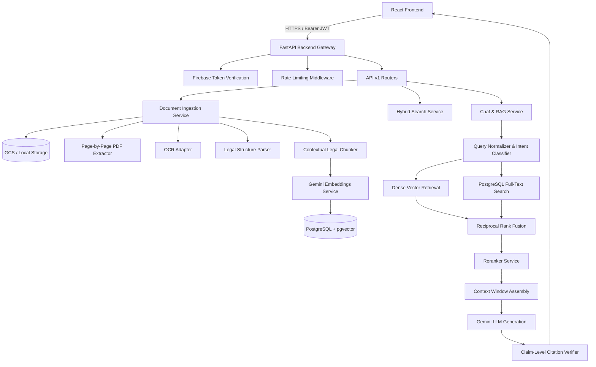

# System Architecture

## Architecture Overview

## Component Boundaries

1. **Presentation Layer (`frontend/`)**: Single-page application written in React with TypeScript and Tailwind CSS. Communicates solely via REST endpoints with JWT bearer authentication.
2. **API & Core Layer (`backend/app/core/`, `backend/app/api/`)**: Enforces authentication, authorization (owner isolation), schema validation via Pydantic, correlation tracking, and uniform error formatting.
3. **Domain & Retrieval Services (`backend/app/services/`)**: Independent, modular services handling document extraction, chunking, embeddings, hybrid retrieval, and LLM orchestration.
4. **Data Layer (`backend/app/db/`, `PostgreSQL`)**: Relational tables with pgvector extension for similarity search and GIN indexes for full-text search.
